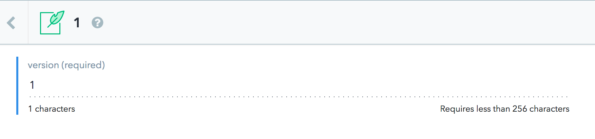

# Contentful Actions

An action for running migration scripts against a Contentful CLI. To learn about making changes to a content model and entries on a Contentful Space using the Contentful CLI check out our [tutorial on Scripting Migrations](https://www.contentful.com/developers/docs/tutorials/cli/scripting-migrations/). You can read our [conceptual guide](https://www.contentful.com/developers/docs/concepts/deployment-pipeline/) on how to utilize Contentful Environments inside your continuous delivery pipeline.

## Usage

See action.yml or our [example usage](https://github.com/contentful-labs/contentful-action-example) in our contentful-action-example repository. This action requires a folder labeled migration where your scripts live. For GitHub to know which migrations it should run, we’ll need to track which migrations have been run by adding a version number into Contentful. We accomplish this in Contentful by creating a new content model with an ID of versionTracking that has a single short-text-field named version.



You’ll also need to create one entry of your new content model with the value 1. We'll be using integers in this action to track migrations.

```yml
  uses: contentful/contentful-action@v1
  env: # Set the secret as an input
    SPACE_ID: ${{ secrets.SPACE_ID }}
    MANAGEMENT_API_KEY: ${{ secrets.MANAGEMENT_API_KEY }}
```

License
=======

Copyright (c) 2019 Contentful GmbH. Code released under the MIT license. See [LICENSE](LICENSE) for further details.


